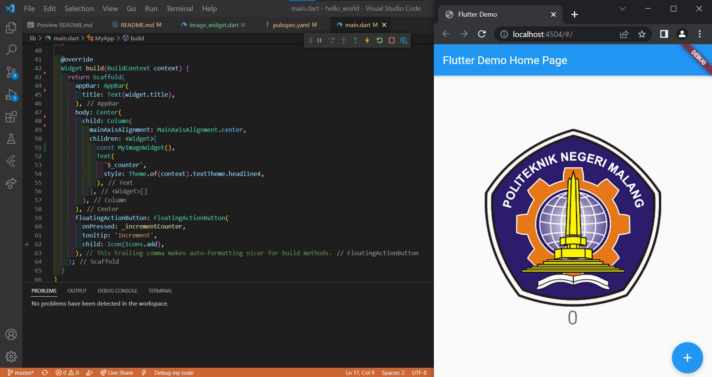
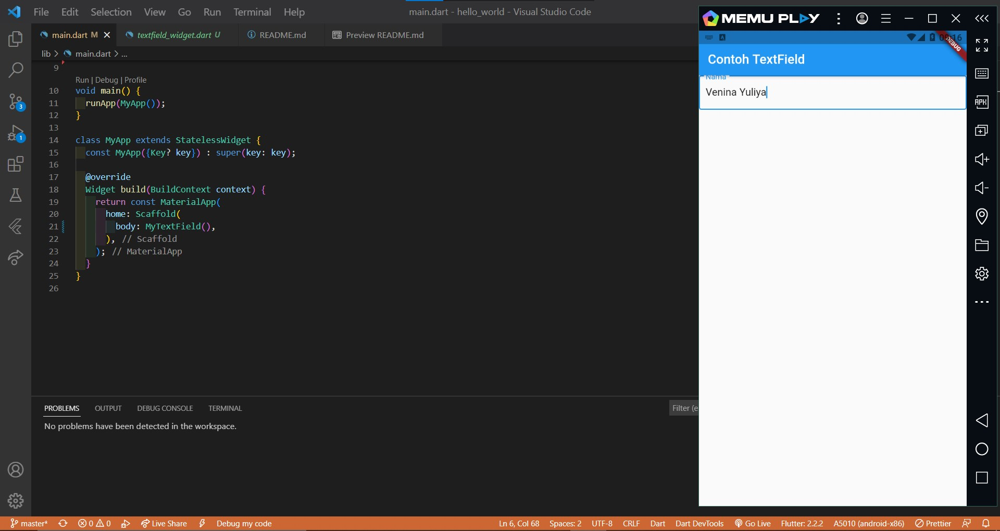

# hello_world

## Praktikum 1: Membuat Project Flutter Baru

## Praktikum 2: Membuat Repository GitHub dan Laporan Praktikum

## Praktikum 3: Menerapkan Widget Dasar

Langkah 1: Text Widget

Langkah 2: Image Widget

## Praktikum 4: Menerapkan Widget Material Design dan iOS Cupertino

Langkah 1: Cupertino Button dan Loading Bar

Langkah 2: Floating Action Button (FAB)

Langkah 3: Scaffold Widget

Langkah 4: Dialog Widget

Langkah 5: Input dan Selection Widget

Langkah 6: Date and Time Pickers

